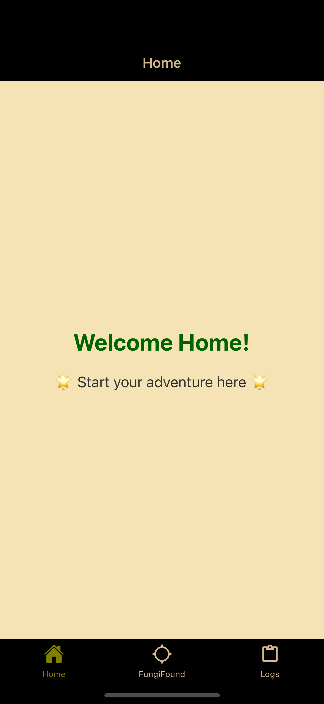
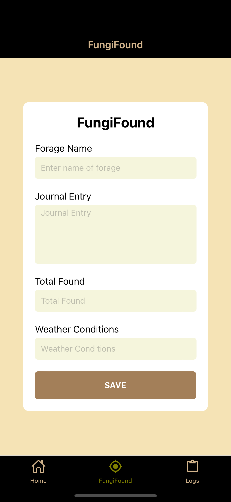
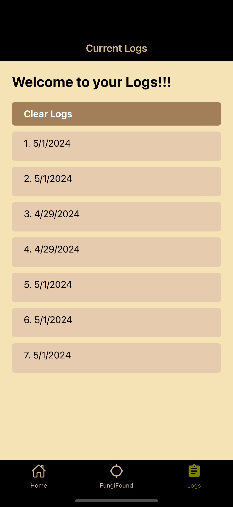

# Fungi-Finder

Fungi-Finder is a mobile application designed to help users find, log, and persist data for various foraged items, such as mushrooms. It allows users to record details about their foraging experiences, including the name of the forage, journal entries, total found, weather conditions, date, time, and location.

## Features

- **Log Forages**: Users can log details about their foraging experiences, including the name of the forage, journal entries, total found, weather conditions, date, time, and location.
- **View Logs**: Users can view their previously logged foraging experiences, including all recorded details.
- **Clear Logs**: Users have the option to clear all logged foraging data from the application.

## Screenshots

  
  
  

## Installation

To run the Fungi-Finder application on your local machine, follow these steps:

1. Clone this repository to your local machine.
2. Navigate to the project directory.
3. Install dependencies by running `npm install` or `yarn install`.
4. Run the application using Expo by running `expo start`.

## Dependencies

Fungi-Finder utilizes the following dependencies:

- **React Native**: A framework for building native applications using React.
- **Expo**: A platform for building and deploying universal React applications.
- **Redux Toolkit**: A toolkit for efficient Redux development.
- **AsyncStorage**: An asynchronous, persistent, key-value storage system for React Native.
- **React Native Vector Icons**: A set of customizable icons for React Native applications.
- **React Native UUID**: A library for generating unique identifiers (UUIDs) in React Native applications.
- **Expo Location**: A module for accessing device location information in Expo applications.

## Usage

1. Upon opening the application, users are greeted with a home screen where they can start their foraging adventure.
2. Users can navigate to the "FungiFound" tab to log details about their foraging experiences, including the name of the forage, journal entries, total found, and weather conditions.
3. Users can view their previously logged foraging experiences by navigating to the "Logs" tab.
4. In the "Logs" screen, users can see a list of all logged foraging experiences. Tapping on a log item will display detailed information about that specific foraging experience.
5. Users have the option to clear all logged
